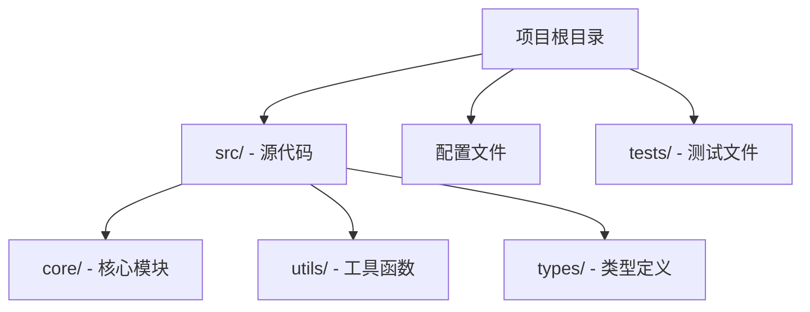
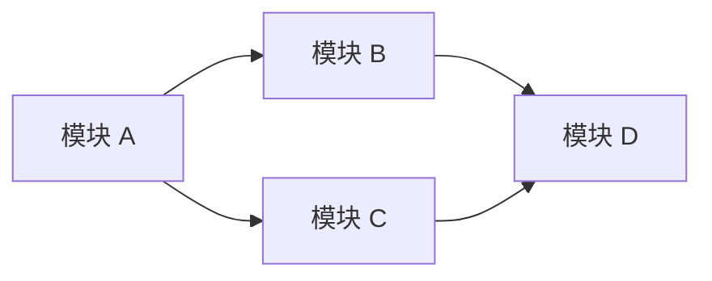
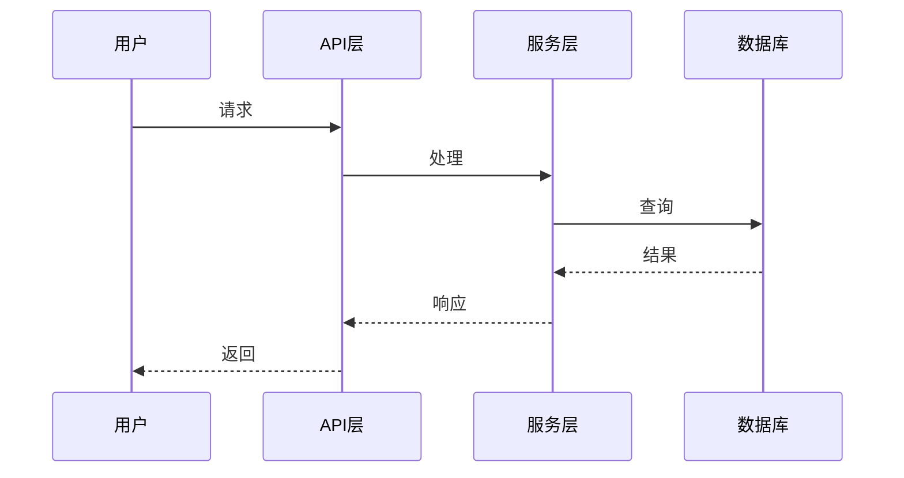
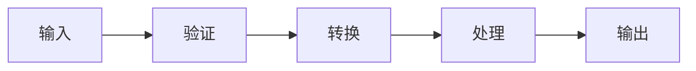
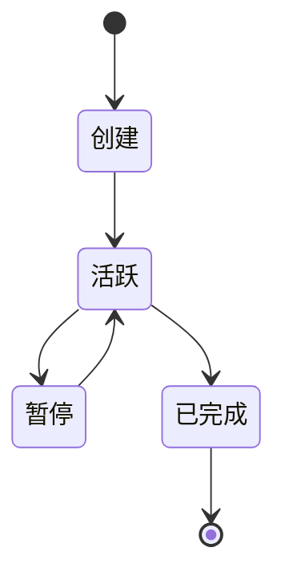

# RepoWiki

仓库报告生成器，基于当前仓库的代码结构、配置文件和依赖关系，生成 DeepWiki 风格的深度分析报告。
以下以ts语言为示例，不代表用户实际项目信息。

> **如项目中已存在存在 REPOWIKI.md 文件，请忽略或删除 REPOWIKI.md 文件（覆盖模式）**

## 报告结构规范

生成的报告必须严格遵循以下分层结构，输出为**单个**Markdown 文件。

### 第一层：项目概述

```markdown
# {项目名称}

> {一句话项目定位描述}

## 目的与范围

{2-3 段落描述项目解决什么问题、核心价值、目标用户}

## 技术栈

| 类别     | 技术 | 用途 |
| -------- | ---- | ---- |
| 语言     | ...  | ...  |
| 框架     | ...  | ...  |
| 构建工具 | ...  | ...  |
| 测试     | ...  | ...  |
| 数据库   | ...  | ...  |

## 仓库结构

{Mermaid 图表：展示顶层目录结构和模块关系}

## 核心系统概览

{Mermaid 图表：展示主要子系统之间的交互}
```

### 第 1.5 层：概念与设计理念

在项目概述和模块分析之间，添加一个解释项目**核心思想和技术原理**的章节——不是它做什么，而是为什么这样设计。

```markdown
## 设计理念与关键决策

### 核心概念

{1-2 段落解释驱动项目设计的基本洞察或方法。
传统方法有什么问题？本项目采用了什么替代思维模型？}

### 关键技术决策

| 决策点           | 选择      | 放弃                 | 原因                   |
| ---------------- | --------- | -------------------- | ---------------------- |
| {例如：状态管理} | {Zustand} | {Redux, Context API} | {原因——具体的权衡分析} |
| ...              | ...       | ...                  | ...                    |

### 架构原则

{2-4 个要点，概括从代码中提取的非显而易见的设计原则。
每条应解释代码库遵循的约束或约定，以及原因。}
```

这一层对于 DeepWiki 级别的报告至关重要：读者需要在深入了解**做什么**之前先理解**为什么**。

### 第二层：模块与包分析

```markdown
## 模块清单

| 模块 | 路径 | 职责 | 关键依赖 |
| ---- | ---- | ---- | -------- |
| ...  | ...  | ...  | ...      |

## 模块依赖架构

{Mermaid 图表：模块间依赖关系图}

## {模块名称} 详细分析

<details>
<summary>相关源文件</summary>

- `path/to/file1.ts`
- `path/to/file2.ts#L5-L10`
</details>

### 职责与边界

{该模块负责什么、不负责什么}

### 内部架构

{Mermaid 图表：模块内的类/函数关系}

### 关键接口

{代码块：主要导出的 API、类型定义、接口}

### 数据流

{Mermaid 序列图/流程图：模块内数据如何流动}
```

### 第三层：核心系统深度分析

为每个核心系统生成独立章节：

```markdown
## {系统名称}

<details>
<summary>相关源文件</summary>

- `path/to/relevant/file.ts#L1-L10`
</details>

### 问题与方法

{每个核心系统章节以叙事弧线开始：

1.  该系统解决什么问题？
2.  传统/朴素方法是什么？为什么在这里行不通？
3.  本项目使用什么洞察或方法？
    这种“问题 → 传统方案失效 → 本项目方案”的叙事结构是 DeepWiki 质量分析的关键。}

### 系统架构

{Mermaid 图表：系统整体架构图}

### 核心工作流

{Mermaid 序列图：主要业务流程}

### 关键组件

| 组件 | 文件 | 职责 |
| ---- | ---- | ---- |
| ...  | ...  | ...  |

### 设计决策与权衡

| 决策点 | 选择 | 放弃 | 原因 |
| ------ | ---- | ---- | ---- |
| ...    | ...  | ...  | ...  |

{对于该系统内的每个主要设计决策，解释选择了什么而非什么替代方案，以及原因。
每个核心系统章节都必须包含此对比表格。}

### 配置与扩展点

{代码块：关键配置文件片段}
```

### 第四层：基础设施与工具链

```markdown
## 构建系统

### 构建流程

{Mermaid 流程图：从源码到产物的完整过程}

### 构建配置

{表格：关键构建配置项}

## 测试基础设施

### 测试策略

| 测试类型 | 工具 | 覆盖范围 |
| -------- | ---- | -------- |
| 单元测试 | ...  | ...      |
| 集成测试 | ...  | ...      |
| E2E 测试 | ...  | ...      |

### 测试配置

{代码块：关键测试配置文件片段}

## CI/CD 流水线

{Mermaid 流程图：CI/CD 流程}

## 依赖管理

### 关键依赖

| 依赖 | 版本 | 用途 |
| ---- | ---- | ---- |
| ...  | ...  | ...  |

### 依赖策略

{版本锁定、更新策略、安全审计}
```

## Mermaid 图表规范

**重要：Mermaid 语法注意事项：**

- 不要在节点标签或边标签中使用括号 `()` —— 它们会破坏解析器。使用 `（）`（全角）或重新措辞。
- 不要在标签字符串中使用特殊字符 `{}[]()` 且未转义。如果标签包含特殊字符，请用 `["..."]` 包裹。
- 始终确保图表类型声明（graph, flowchart, sequenceDiagram, stateDiagram-v2）与正文使用的语法匹配。

每份报告必须包含以下类型的图表：

### 1. 仓库结构图（必需）



### 2. 模块依赖图（必需）



### 3. 核心工作流图（必需）



### 4. 数据流图（按需）



### 5. 状态/生命周期图（按需）



## 分析执行流程

### 步骤 1：收集仓库元数据

调用可用的工具/使用命令收集信息（并行执行）：

1. **目录结构** - 使用命令扫描 `**/*` 获取完整文件树
2. **包管理** - 读取 `package.json`、`pnpm-workspace.yaml`、`go.mod`、`Cargo.toml`、`gradle/*.toml`、`pom.xml` 等
3. **配置文件** - 读取 `tsconfig.json`、`.eslintrc.*`、`vite.config.*`、`webpack.config.*`、`**/**/build.gradle.kts` 等
4. **CI/CD** - 读取 `.github/workflows/*.yml`、`.gitlab-ci.yml`、`Dockerfile` 等
5. **Git 历史** - 从最近 100 次提交中获取文件变更频率

### 步骤 2：识别核心系统

以下信号用来辅助判断核心系统（不是绝对）：

| 信号         | 权重 | 方法                |
| ------------ | ---- | ------------------- |
| 文件变更频率 | 高   | git log 统计        |
| 目录大小     | 中   | 文件数量            |
| 入口文件引用 | 高   | grep import/require |
| README 提及  | 中   | 读取文档            |
| 导出数量     | 中   | grep export         |

### 步骤 3：深入分析每个系统

对每个核心系统执行：

1. 读取该目录下的所有文件
2. 识别主要类、函数和类型定义 —— **包含 file#Lline-Lline 引用**（例如 `src/engine.ts#L1-L5`），方便读者直接导航到源码
3. 追踪导入/导出依赖链
4. 识别设计模式（Repository、Factory、Observer 等）
5. 提取关键配置和常量
6. 对于关键算法或工作流，提供**逐步代码逻辑分析** —— 追踪实际实现，而不仅仅在接口层面描述

### 步骤 4：生成 Mermaid 图表

根据分析结果，生成：

- 至少 1 个架构概览图
- 至少 1 个模块依赖图
- 至少 1 个核心工作流序列图
- 根据需要添加状态图和数据流图

### 步骤 5：组装报告

按照上述结构规范组装完整报告，输出到 `REPOWIKI.md`。

## 源文件引用规范

每个章节必须包含可折叠的源文件引用：

```markdown
<details>
<summary>相关源文件</summary>

- `src/core/engine.ts` - 核心引擎实现
- `src/core/types.ts` - 类型定义
- `src/config/default.ts#L1-L5` - 默认配置
</details>
```

引用规则：

- 仅引用与当前章节**直接相关**的文件
- 每个引用附带简要描述
- 按重要性排序，最关键的文件在前
- 每个章节 3-10 个引用文件（若有）

## 表格使用规范

在以下场景**必须**使用表格：

1. **技术栈** - 语言、框架和工具清单
2. **模块清单** - 所有模块的路径、职责和依赖
3. **配置对比** - 不同环境/模式的配置差异
4. **API 清单** - 公共 API 的方法、参数和返回值
5. **依赖清单** - 关键依赖的版本和用途

## 输出要求

1. **文件名**：`REPOWIKI.md`，放在仓库根目录
2. **语言**：与用户对话语言一致（中文对话 = 中文报告，因为对话 = 英文报告）
3. **长度**：
   - 小型项目（<50 个文件）：800-1500 行
   - 中型项目（50-200 个文件）：1500-3000 行
   - 大型项目（>200 个文件）：3000-6000 行
4. **图表数量**：至少 3 个 Mermaid 图表，大型项目 6-10 个
5. **表格数量**：至少 3 个表格
6. **代码块**：关键配置和接口定义，每个不超过 30 行

## 质量检查清单

生成报告后，验证以下项目：

- [ ] 包含项目概述和一句话定位
- [ ] 技术栈表格完整准确
- [ ] 仓库结构 Mermaid 图表与实际一致
- [ ] 每个核心系统有独立章节
- [ ] 每个章节有可折叠的源文件引用
- [ ] 模块依赖图正确反映实际依赖关系
- [ ] 至少有一个序列图展示核心工作流
- [ ] 所有表格格式正确、内容准确
- [ ] 代码块语法高亮正确
- [ ] 没有虚构的文件或模块
- [ ] Mermaid 图表语法正确且可渲染

## 示例片段

以下是 TypeScript Web 项目的报告片段示例：

```markdown
# MyApp

> 基于 Next.js 构建的全栈电商平台，支持多租户和实时库存管理。

## 目的与范围

MyApp 是面向中小型商家的电商 SaaS 平台。它提供商品管理、订单处理、
支付集成和实时库存同步等核心功能。项目采用 Next.js App Router 架构，
Prisma 作为 ORM，PostgreSQL 作为主数据库。

## 技术栈

| 类别   | 技术                | 用途             |
| ------ | ------------------- | ---------------- |
| 语言   | TypeScript 5.3      | 全栈开发语言     |
| 框架   | Next.js 14          | 全栈 React 框架  |
| ORM    | Prisma 5.8          | 数据库访问层     |
| 数据库 | PostgreSQL 16       | 主数据存储       |
| 缓存   | Redis 7             | 会话和热数据缓存 |
| 测试   | Vitest + Playwright | 单元和 E2E 测试  |

## 仓库结构

``mermaid
graph TD
Root["myapp/"]
Root --> App["app/ - Next.js App Router"]
Root --> Lib["lib/ - 共享业务逻辑"]
Root --> Components["components/ - UI 组件"]
Root --> Prisma["prisma/ - 数据库 Schema"]
Root --> Tests["tests/ - 测试文件"]

    App --> API["api/ - API 路由"]
    App --> Pages["routes/ - 页面"]
    Lib --> Services["services/ - 业务服务"]
    Lib --> Utils["utils/ - 工具函数"]

``

## 核心系统概览

`mermaid
graph LR
    Client["客户端"] --> AppRouter["App Router"]
    AppRouter --> Auth["认证系统"]
    AppRouter --> API["API 层"]
    API --> OrderService["订单服务"]
    API --> ProductService["商品服务"]
    API --> PaymentService["支付服务"]
    OrderService --> DB["PostgreSQL"]
    ProductService --> DB
    ProductService --> Cache["Redis"]
    PaymentService --> Stripe["Stripe API"]
`

## 订单系统

<details>
<summary>相关源文件</summary>

- `lib/services/order.ts` - 订单服务核心逻辑
- `app/api/orders/route.ts` - 订单 API 路由
- `prisma/schema.prisma` - 订单数据模型
- `lib/validators/order.ts#L1-L5` - 订单数据验证
- `components/order/OrderForm.tsx#L1-L5` - 订单表单组件

</details>

### 目的与范围

订单系统管理从购物车到支付完成的完整订单生命周期。
包括订单创建、库存锁定、支付处理、状态转换和通知发送。

### 订单生命周期

`mermaid
stateDiagram-v2
    [*] --> 已创建: 用户下单
    已创建 --> 支付中: 发起支付
    支付中 --> 已支付: 支付成功
    支付中 --> 已取消: 支付超时/失败
    已支付 --> 配送中: 商家发货
    配送中 --> 已完成: 确认收货
    已完成 --> [*]
    已取消 --> [*]
`
```

## 语言/框架适配

根据项目类型调整分析重点：

| 项目类型           | 分析重点                                 |
| ------------------ | ---------------------------------------- |
| Node.js/TypeScript | package.json、tsconfig、模块导出         |
| Go                 | go.mod、包结构、接口定义                 |
| Python             | pyproject.toml、包结构、类层次结构       |
| Rust               | Cargo.toml、crate 结构、trait 定义       |
| Java/Kotlin        | pom.xml/build.gradle、包结构、类层次结构 |
| Monorepo           | 工作区配置、包间依赖、构建顺序           |
| 前端 SPA           | 路由结构、状态管理、组件树               |
| 后端 API           | 路由定义、中间件链、数据模型             |
| CLI 工具           | 命令结构、参数解析、子命令               |
